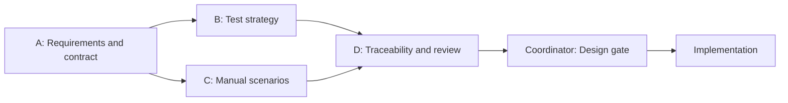

# Game Companion — Plan for Separate Chats

Start with **four documentation chats**, each responsible for one kind of decision or document. Keep coordination in this chat or do it yourself. Begin implementation only after the documentation review gate closes.

This plan provides task prompts; it does not create or message any chats. All application development and test execution remain future work.

## Current state and the five findings

The repository has documentation drafts and no application/test implementation. The previously missing test plan and scenarios now have drafts. Review and refine the existing files rather than asking several chats to recreate them.

| Finding | Decision now written in the drafts | Owner for review |
| --- | --- | --- |
| 1. Browser scope conflict | Three-browser smoke/full UI applies to desktop at 1280 x 800. Phone at 375 x 812 requires only `TEST-UI-13` in Chromium; WebKit phone is optional. | A defines scope; B checks the execution matrix. |
| 2. Query scope unclear | List accepts `search` and `genre` once each. Detail and notes accept no query keys. Feedback also accepts no keys for a consistent strict policy. Path validation precedes query validation on detail/notes; feedback query validation precedes body validation. | A defines the contract; C covers cases; D checks links. |
| 3. Detail/notes failure behavior missing | Separate loading, HTTP `500`/network error, Retry, `404`, and late-response behavior are specified by `REQ-DET-03` and `REQ-DET-04`. | A defines behavior; C writes procedures; D checks coverage. |
| 4. Email rules insufficiently exercised | `EMAIL-01` through `EMAIL-27` name valid/invalid cases for local-part dots/characters, domain labels/hyphens, and final-label restrictions. Run each through UI and API. | A owns examples; C owns procedures; D checks mapping. |
| 5. Requirements-phase documents absent | `test-plan.md` and `test-scenarios.md` now exist as design drafts. They do not claim a completed test run. | B owns the plan; C owns scenarios. |

These are explicit version-one design choices. If you prefer a different choice, send the change to A first, then update B/C and run D's consistency review. A test author must not silently change product behavior to fit the tests.

## File ownership

| Chat | Purpose | Files it may edit | Completion condition |
| --- | --- | --- | --- |
| A — Requirements and contract | Define what the application promises; resolve findings 1–4. | `PROJECT_PLAN.md`, `test-docs/requirements-and-risks.md` | Scope, API rules/precedence, detail/notes recovery, and named validation cases agree; requirements are observable; existing IDs stay stable. |
| B — Test strategy | Define where/how testing runs and what permits completion. | `test-docs/test-plan.md` | Explicit scope, browser matrix, data/isolation, entry/exit gates, evidence, exclusions, and truthful status; consistent with A. |
| C — Manual scenarios | Turn promises into reproducible steps and variants. | `test-docs/test-scenarios.md` | Every feature has preconditions, inputs, steps, and expected results; all named variants are covered; execution-record fields are defined. |
| D — Traceability and review | Connect requirements, scenarios, inventory, and review findings. | `test-docs/traceability-matrix.md` | Every requirement maps to valid planned tests/scenarios; no broken ID/file links or scope contradiction; remaining findings reported with file/line references. |
| Coordinator — You or this chat | Decide changes, sequence handoffs, and collect unresolved questions. | `test-docs/chat-task-plan.md` | Each task has a handoff; the design gate has a recorded outcome; implementation starts with agreed contracts. |

Other source documents are read-only for each owner. D can fix its matrix but reports changes needed in A/B/C files to their owners. Only the coordinator edits this task plan.

## Order and dependencies



1. **A first:** review the explicit decisions and provide a stable handoff. Fix genuine unresolved requirements before the other chats depend on them.
2. **B and C together:** after A's handoff, they can work in parallel because they own different files. They may flag a contract issue, but A owns its resolution. C does not need to wait for a finished test plan to draft functional steps.
3. **D last:** review the final versions from A/B/C, update the matrix, and report any gap to its owner. Repeat D only after a relevant correction.
4. **Coordinator gate:** check that all five findings are resolved, files/IDs/coverage agree, and every remaining item is either future implementation work or an explicit scope decision. Document review completion separately from execution completion.

For each wave, give the receiving chat the predecessor's handoff and the current files. If A changes the contract after B/C start, pause dependent edits until the updated contract is handed off. Do not rely on another chat remembering this conversation.

## Shared rules for every task prompt

- Work in `D:\Projects\WEB_DEV\WEB-DEV-QA-Portfolio` and inspect applicable repository instructions first.
- Read the current documents before editing. Preserve unrelated changes and stable `REQ-`, `TEST-`, `SCN-`, `BUG-`, and `SIM-` identities. New email variants have descriptive data-case IDs under the existing test inventory, not extra inventory entries.
- Edit only the files assigned to the task. Report required changes to another owner's file in the handoff. Do not create additional chats or delegate again as part of these tasks.
- Keep design, implementation, and execution status separate. No passing results, bug counts, evidence links, commands, or fixture IDs may be invented.
- The 21 inventory entries may expand into multiple variants/browser executions. Preserve required variants rather than deleting them to meet a numeric target.
- Report assumptions and unresolved questions. A documented temporary assumption is not execution evidence.
- Finish with changed files, decisions, checks performed, remaining issues, and what the next chat needs. Do not commit, push, publish, or start implementation as part of these documentation tasks unless separately requested.

If B and C work in the same checkout, their file boundaries prevent conflicting edits. Do not run global formatting or stage another chat's changes. For later code work, agree on setup/config ownership before parallel edits; avoid two chats changing the same dependency file or runner.

## Copy-ready prompts

Copy the shared rules above with the relevant prompt below. These prompts review the current drafts; none authorizes claiming tests were run.

### Chat A — Requirements and contract

```text
Work in D:\Projects\WEB_DEV\WEB-DEV-QA-Portfolio. Review and refine only
PROJECT_PLAN.md and test-docs/requirements-and-risks.md. Read
test-docs/chat-task-plan.md for shared rules and file boundaries.

Your task is to settle the version-one requirements before other chats
write dependent documents. Review these five design decisions:
1. All three browsers are required for desktop smoke/full UI; phone
   requires only the Chromium layout variant, with WebKit optional.
2. The list permits search/genre once each; detail/notes/feedback accept
   no query keys. Validation order and INVALID_QUERY scope are explicit.
3. Detail and notes separately define loading, 500/network errors,
   current-game Retry, non-retryable 404, and stale-response protection.
4. EMAIL-01 through EMAIL-27 cover every stated email format rule in
   UI and API, including acceptance, rejection, and stored normalization.
5. Product rules, inventory text, and risk controls must agree.

Keep IDs stable. Identify any unresolved decision with a concrete
proposed behavior; do not alter another owner's documents or code.
Finish with the agreed contract/scope, changed files, verification,
remaining questions, and a handoff for B and C.
```

### Chat B — Test strategy

```text
Work in D:\Projects\WEB_DEV\WEB-DEV-QA-Portfolio. After A's contract
handoff, review and refine only test-docs/test-plan.md. Read
PROJECT_PLAN.md, test-docs/requirements-and-risks.md, and the shared
rules in test-docs/chat-task-plan.md as read-only sources.

Make the test plan usable for a new contributor: purpose, scope and
exclusions, risk priorities, smoke/full selection, desktop/phone browser
matrix, required versus optional checks, environment recording,
versioned fixtures, DB_PATH/process ownership, serial tests and isolated
variants, storage setup, failure injection, evidence, entry/exit gates,
and reporting. Keep API/database entries in one project and ensure no
overlapping browser projects share a database.

Keep all results planned. Use explicit prerequisites for commands,
versions, and fixture values that do not exist yet. If A's contract
needs a change, report it rather than changing source requirements.
Finish with changed files, checks, open issues, and a handoff for D.
```

### Chat C — Manual scenarios

```text
Work in D:\Projects\WEB_DEV\WEB-DEV-QA-Portfolio. After A's contract
handoff, review and refine only test-docs/test-scenarios.md. Read the
project plan, requirements, draft test plan, and shared rules in
test-docs/chat-task-plan.md as read-only sources.

Ensure each scenario has stable SCN identity, linked requirements/test
inventory, preconditions, inputs, reproducible steps, and expected
results. Cover search/filter precedence and late responses; favourites
storage/validation; separate detail and notes loading/failure/Retry/404;
all named email variants and description code-point boundaries; feedback
failure preservation and SQL non-insertion; query/ID precedence;
desktop/phone layout; keyboard/announcements; and startup/reset/rollback.

Define what an execution record captures, but leave every scenario
planned. Do not fabricate seed IDs, commands, results, or defects. Flag
contract gaps to A and strategy gaps to B. Finish with changed files,
checks, remaining issues, and a handoff for D.
```

### Chat D — Traceability and documentation review

```text
Work in D:\Projects\WEB_DEV\WEB-DEV-QA-Portfolio. After the A/B/C
handoffs, read all planning documents and edit only
test-docs/traceability-matrix.md. Follow the shared rules in
test-docs/chat-task-plan.md.

Map every REQ to valid planned TEST entries and SCN procedures. Verify
the new detail/notes requirements, every named email variant, query
scope/precedence, browser matrix, fixture needs, isolation, and gates.
Check IDs and relative links. Review all five original findings for
consistent resolution across the final documents. Check that no draft
claims implemented or passing tests.

Fix matrix issues yourself. Report other issues with severity,
file/line, why they matter, the responsible owner, and a proposed fix.
Finish with checks performed, each finding's resolved/open status,
remaining issues, and a design-gate recommendation for the coordinator.
Do not implement the app or create execution/defect evidence.
```

## Required handoff format

Each owner returns these five items in their chat:

1. Files changed and the task's final status.
2. Decisions made, assumptions, and stable IDs added/changed.
3. Checks actually performed and their outcome; state if no tests were executed.
4. Open issues with the owner and proposed resolution.
5. What the next chat can start and what still blocks it.

The coordinator records the review outcome here after those handoffs. Current outcome: **drafts prepared; independent chat reviews not performed; no application/test execution.**

## Later implementation split

Do not open all future chats at once. After the design gate, use these responsibilities and start only when the dependency is ready:

| Responsibility | Owns | Starts after | Handoff |
| --- | --- | --- | --- |
| App foundation and API/data | Project setup/dependencies, TypeScript configuration, `app/api/`, `app/db/`, versioned seed, app process/start/reset contract | Design gate | Runnable API/seed, fixed fixture expectations, verified commands, DB_PATH/readiness/process lifecycle, safe isolated failure hooks. |
| Frontend | `app/ui/`; request build/config changes from the foundation owner | Foundation has fixed API/seed/start contract; UI scaffolding can then proceed alongside API completion | Usable catalogue/detail/notes/favourites/feedback with specified recovery, labels, and responsive layout. |
| Manual and exploratory QA | Execution records, exploratory charter, genuine bug reports or labelled simulations, representative evidence | First runnable feature; expand after the full minimal app | Actual results and investigated issues for the automation owner. |
| Automation | `tests/`, `playwright.config.ts`, test runner/fixtures, `sql/verification-queries.sql`; request app hooks from foundation owner | Runnable app, manual pass, fixed data/process contract | Five smoke paths first, then 21 entries and variants; verified suite commands, reports and failure artifacts. |
| CI and portfolio | `.github/workflows/`, README, test summary; coordinate scripts/config with foundation and automation owners | Reliable local suites and evidence | Required CI coverage, successful verified run, reproducible instructions, truthful coverage/limitations. |

Reuse chats as stages advance if that is easier to manage. The smallest first implementation milestone is catalogue/search/filter plus detail/notes and seeded API data. Add favourites and feedback next, then expand QA/automation and CI. Do not allow future implementation roles to override the agreed requirements without returning the decision to the documentation owner.
